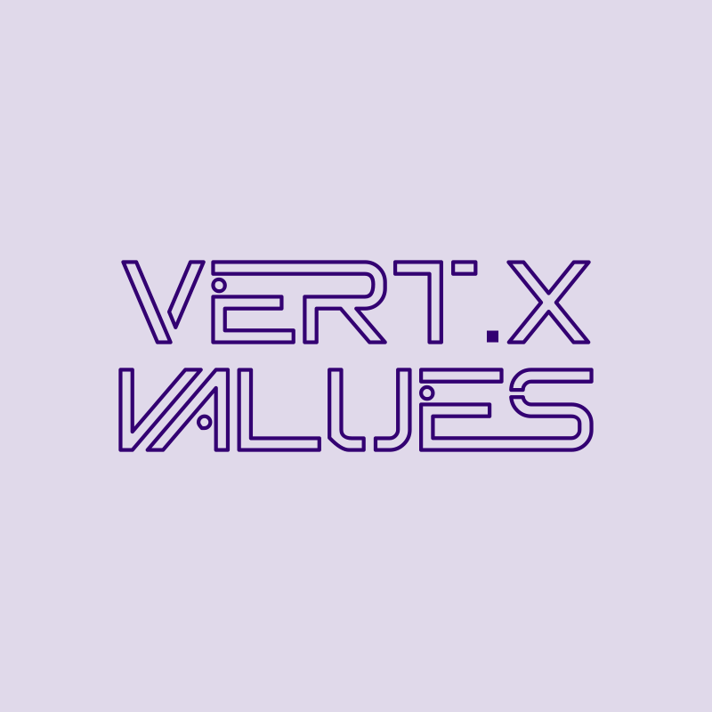
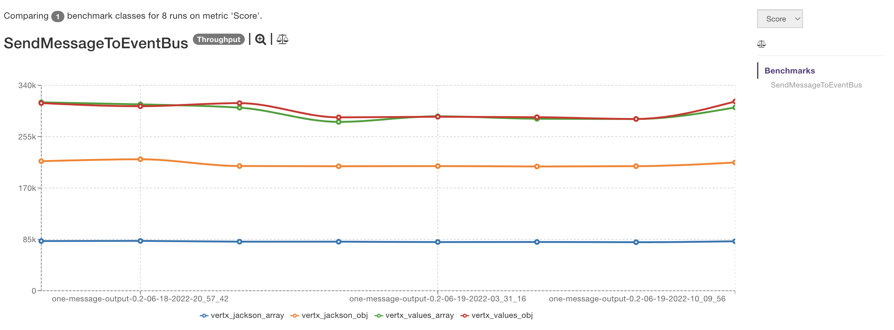

<p align="center">
  
</p>

"_Immutability Changes Everything._"
**Pat Helland**

[](https://search.maven.org/artifact/com.github.imrafaelmerino/vertx-json-values/1.0.0/jar)

- [Goal](#goal)
- [Explanation](#exp)
- [How-to](#howto)
- [Performance](#perf)
- [Requirements](#requirements)
- [Installation](#inst)

## <a name="goal"><a/> Goal

The goal of this section is to address a common practice in Vertx, which involves sending messages in JSON format due to
its simplicity and widespread compatibility across various programming languages supported by Vertx. However, a
significant challenge arises when sending messages as JsonObject or JsonArray types, as Vertx is required to create a
copy of the message each time it's sent over the Event Bus. This process becomes increasingly detrimental to
performance, especially with larger JSON payloads, and places a considerable burden on the Garbage Collector.

To mitigate these issues, vertx-values steps in to provide support for transmitting immutable JSON objects from
json-values. This library offers a genuinely immutable JSON representation achieved through the use of persistent data
structures and adheres to functional programming principles. Not only does json-values enable the creation, validation,
generation, and manipulation of JSON data, but it also offers a straightforward and functional API for these tasks. The
ultimate goal is to enhance the efficiency and performance of JSON message transmission within Vertx applications.

## <a name="exp"><a/> Explanation

Every type (`Integer`, `String`, `JsonObject`, `JsonArray`, `Buffer`, etc.) that can be sent
across the Event Bus has an
associated [MessageCodec](https://vertx.io/docs/apidocs/io/vertx/core/eventbus/MessageCodec.html).
A `MessageCodec` is where it's defined how to serialize
and deserialize a message. A third method called `transform` is also
implemented in this class. When a verticle sends a message locally to the EB, Vertx intercepts
that message and calls its codecs `transform` method.

Go to the source
package [io.vertx.core.eventbus.impl.codecs](https://vertx.io/docs/apidocs/io/vertx/core/eventbus/impl/codecs/package-frame.html)
to check out what types Vertx supports. The good thing is that you can define your codecs
to send messages of new types to the EB.

The default JSONs implemented in Vertx with **Jackson**, [JsonObject](https://vertx.io/docs/apidocs/io/vertx/core/json/JsonObject.html) and
[JsonArray](https://vertx.io/docs/apidocs/io/vertx/core/json/JsonArray.html), have the
codecs [JsonObjectMessageCodec](https://vertx.io/docs/apidocs/io/vertx/core/eventbus/impl/codecs/JsonObjectMessageCodec.html)
and [JsonArrayMessageCodec](https://vertx.io/docs/apidocs/io/vertx/core/eventbus/impl/codecs/JsonArrayMessageCodec.html).
Let's
take a look at their `transform` method implementation:

```code

// Vertx impl 
public JsonObject transform(JsonObject message) {
    return message.copy();
}

```

Since **Jackson** is not immutable at all, the `transform` method
has to make a copy of the message before sending it to the EB. Otherwise, we would have
a shared reference to an object among independent Verticles, which would be
a nightmare and violates some of the most basic principles of message-passing
architectures.

As I pointed out before, making a copy every time a message is sent is inefficient and put more pressure on
the Garbage Collector, especially if you have a large number of Verticles communicating one to
each other.

vertx-values provides codecs to send [json-values](https://github.com/imrafaelmerino/json-values) across the EB.
Take a look at the `transform` method of its codecs:

```code

// vertx-values impl
public JsObj transform(final JsObj message) {
   return message;
}

```

**As you can see, it returns the same message without making any copy**.
And if that was not enough, immutable data structures have a lot of benefits,
especially in concurrent programs and architectures based on the actor model like Vertx.

## <a name="howto"><a/> How to

Registering the codecs from vertx-values is a straightforward process that involves deploying a Verticle. Here's how you
can achieve this in Vertx:

```code  
import vertx.values.codecs.RegisterJsValuesCodecs;

vertx.deployVerticle(new RegisterJsValuesCodecs(), 
                     r -> System.out.println("Registered codecs!")
                    );
                    
```

When you deploy the codecs Verticle, it registers the necessary codecs for vertx-values. If you attempt to register the
codecs more than once, Vertx will detect this and prevent duplicate registrations, ensuring that you don't inadvertently
overwrite or interfere with previously registered codecs.

This simple process allows you to enable the use of vertx-values' immutable JSON representations in your Vertx
application, improving message transmission efficiency and reducing the load on the Garbage Collector.

## <a name="perf"><a/> Performance

Let's illustrate the efficiency gains of using vertx-values with a practical example. We'll create a Verticle named "
bounce" that echoes back the messages it receives:

``` code

 vertx.eventBus()
      .consumer("bounce", 
                message -> message.reply(message.body())
               )

```

Now, we'll send two types of messages to the "bounce" Verticle for comparison:

- A JSON object: obj
- A JSON array containing four identical objects: [obj, obj, obj, obj]

We will measure the performance of these message transmissions using both the JSON representation from Vertx and the
JSON from json-values. To ensure accurate benchmarking, we'll employ jmh, a reliable Java benchmarking tool.

I ran this benchmark test eight times on my computer (MacBook Pro with Apple M1 chip, 8 cores, 16GB LPDDR4 RAM) and
recorded the results, which I subsequently uploaded to JMH Visualizer. Here's the chart summarizing the outcomes:





The chart reveals a clear performance advantage when using vertx-values. Whether sending a single JSON object or a JSON
array four times larger, the results remain consistently efficient. This efficiency is attributed to the absence of
message copying before transmission, a feature inherent to vertx-values.

Conversely, when transmitting JSON objects from Vertx, performance declines by approximately 40%, and sending JSON
arrays causes a severe performance degradation. This degradation is primarily due to the time-consuming process of
copying larger objects. These findings underscore the benefits of adopting vertx-values for improved efficiency in your
Vertx applications, particularly when handling substantial JSON payloads.

## <a name="requirements"><a/> Requirements

- For versions prior to 0.7, json-values requires Java 8 or later. Please note that only fixes are accepted for these
  versions.
- For versions starting from 0.8 and beyond, json-values mandates Java 17 or later.

## <a name="inst"><a/> Installation

To include json-values in your project, add the corresponding dependency to your build tool based on your Java version:

For Java 8 or higher:

```xml

<dependency>
    <groupId>com.github.imrafaelmerino</groupId>
    <artifactId>vertx-json-values</artifactId>
    <version>0.7</version>
</dependency>
```

For Java 17 or higher:

```xml

<dependency>
    <groupId>com.github.imrafaelmerino</groupId>
    <artifactId>vertx-json-values</artifactId>
    <version>1.0.0</version>
</dependency>
```

Choose the appropriate version according to your Java runtime.

